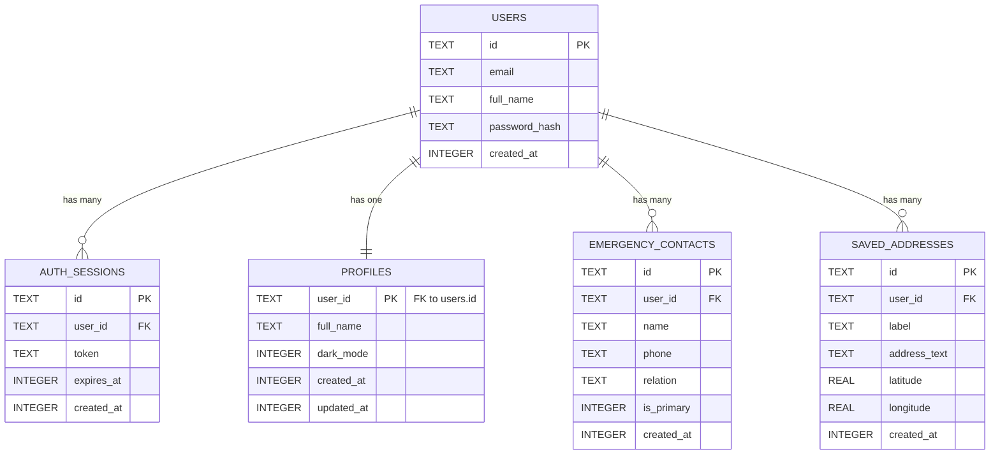

# Database Analysis & Reverse Engineering Report

> [!NOTE]
> **Architecture finding**: This application uses a local **SQLite** database (`expo-sqlite`) instead of a remote MongoDB backend. The schema is defined in `src/services/sqlite.ts`. The "MERN" stack assumption in the prompt does not apply to this codebase.

## 1. Visual Relationship Diagram

## 2. Comprehensive Schema Tables

### Table: `users`
| Field | Type | Required? | Description/Ref |
|-------|------|-----------|-----------------|
| `id` | TEXT | Yes | Primary Key (UUID) |
| `email` | TEXT | Yes | Unique, Lowercased |
| `full_name` | TEXT | No | User's display name |
| `password_hash`| TEXT | Yes | SHA256 Hash + Salt |
| `created_at` | INTEGER | No | Timestamp |

### Table: `auth_sessions`
| Field | Type | Required? | Description/Ref |
|-------|------|-----------|-----------------|
| `id` | TEXT | Yes | Primary Key (Session ID) |
| `user_id` | TEXT | Yes | Foreign Key -> `users.id` |
| `token` | TEXT | Yes | Unique Session Token |
| `expires_at` | INTEGER | Yes | Expiration Timestamp |
| `created_at` | INTEGER | No | Timestamp |

### Table: `profiles`
| Field | Type | Required? | Description/Ref |
|-------|------|-----------|-----------------|
| `user_id` | TEXT | Yes | Primary Key. Foreign Key -> `users.id` |
| `full_name` | TEXT | No | Profile display name |
| `dark_mode` | INTEGER | No | 0 = False, 1 = True (Default 0) |
| `created_at` | INTEGER | No | Timestamp |
| `updated_at` | INTEGER | No | Timestamp |

### Table: `emergency_contacts`
| Field | Type | Required? | Description/Ref |
|-------|------|-----------|-----------------|
| `id` | TEXT | Yes | Primary Key (Random String) |
| `user_id` | TEXT | No* | Foreign Key -> `users.id` (Implied) |
| `name` | TEXT | No | Contact Name |
| `phone` | TEXT | No | Normalized Phone Number |
| `relation` | TEXT | No | Relationship (e.g., Parent) |
| `is_primary` | INTEGER | No | 0 = False, 1 = True (Default 0) |
| `created_at` | INTEGER | No | Timestamp |

### Table: `saved_addresses`
| Field | Type | Required? | Description/Ref |
|-------|------|-----------|-----------------|
| `id` | TEXT | Yes | Primary Key (Random String) |
| `user_id` | TEXT | No* | Foreign Key -> `users.id` (Implied) |
| `label` | TEXT | No | e.g., "Home", "Work" |
| `address_text` | TEXT | No | Full address string |
| `latitude` | REAL | No | Geo coordinate |
| `longitude` | REAL | No | Geo coordinate |
| `created_at` | INTEGER | No | Timestamp |

## 3. Data Usage Report

### **[Table: users]**
*   **Stored via:** `src/services/sqlite.ts` -> `createUser()`
    *   Called by `firebaseClient.ts` during `createUserWithEmailAndPassword`.
*   **Accessed via:** `src/services/sqlite.ts` -> `getUserByEmail()` or `authenticateUser()`
    *   Used during login flows in `firebaseClient.ts`.
*   **Updated via:** `src/services/userService.ts` -> `upsertUser()`
    *   Updates email or full name.
*   **Critical Logic:**
    *   Passwords are hashed using `Crypto.digestStringAsync` (SHA256) with a salt before storage.
    *   IDs are generated using `Crypto.randomUUID()`.

### **[Table: auth_sessions]**
*   **Stored via:** `src/services/sqlite.ts` -> `createSession()`
    *   Called after successful login/signup.
*   **Accessed via:** `src/services/sqlite.ts` -> `validateSession()`
    *   Checks if token exists and `expires_at > Date.now()`.
*   **Deleted via:** `src/services/sqlite.ts` -> `invalidateSession()`
    *   Called on `signOut`.

### **[Table: profiles]**
*   **Stored/Updated via:** `src/services/profileService.ts` -> `upsertProfile()`
    *   Uses `INSERT` if not exists, otherwise `UPDATE`.
*   **Accessed via:** `src/services/profileService.ts` -> `getProfile()`

### **[Table: emergency_contacts]**
*   **Stored via:** `src/services/contactsService.ts` -> `addContact()`
*   **Accessed via:** `src/services/contactsService.ts` -> `fetchContacts()`
*   **Updated via:** `src/services/contactsService.ts` -> `updateContact()`
*   **Deleted via:** `src/services/contactsService.ts` -> `deleteContact()`
*   **Critical Logic:**
    *   Phone numbers are normalized using `normalizePhone()` (handles +91 prefix).

### **[Table: saved_addresses]**
*   **Stored via:** `src/services/addressService.ts` -> `addSavedAddress()`
*   **Accessed via:** `src/services/addressService.ts` -> `fetchSavedAddresses()`
*   **Updated via:** `src/services/addressService.ts` -> `updateSavedAddress()`
*   **Deleted via:** `src/services/addressService.ts` -> `deleteSavedAddress()`
