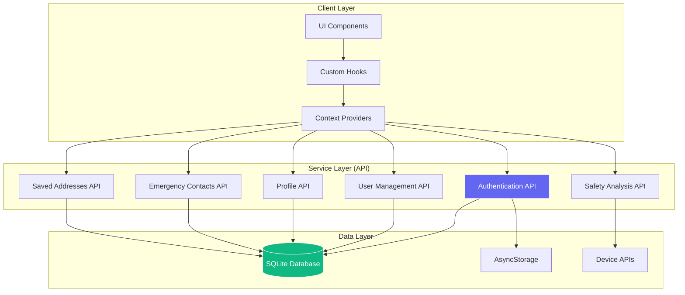

# 📚 SafeRoute Expo - API Documentation

## 📋 Overview

This document provides comprehensive documentation for all APIs, services, and database operations in the SafeRouteExpo mobile application. Since the app uses SQLite as a local database with offline-first architecture, most "APIs" are actually TypeScript service functions that interact with the local database.

## 🏗️ API Architecture



---

## 🔐 Authentication API

### Base Service: `firebaseClient.ts`

#### **Initialize Authentication**
```typescript
initializeAuth(): Promise<void>
```
- **Description**: Initializes auth state from stored session
- **Returns**: Promise<void>
- **Storage**: Reads from AsyncStorage key `saferoute_session_token`

#### **Sign In**
```typescript
signInWithEmailAndPassword(
  _auth: any, 
  email: string, 
  password: string
): Promise<{user: User}>
```

**Request Parameters:**
- `email` (string): User's email address
- `password` (string): User's plain text password

**Response:**
```json
{
  "user": {
    "id": "string",
    "email": "string", 
    "full_name": "string",
    "password_hash": "string",
    "created_at": number
  }
}
```

**Error Codes:**
- `Invalid email or password` - Authentication failed
- Database connection errors

**Example Usage:**
```typescript
try {
  const result = await signInWithEmailAndPassword(null, "user@example.com", "password123");
  console.log("User logged in:", result.user);
} catch (error) {
  console.error("Login failed:", error.message);
}
```

#### **Sign Up**
```typescript
createUserWithEmailAndPassword(
  _auth: any,
  email: string, 
  password: string
): Promise<{user: User}>
```

**Request Parameters:**
- `email` (string): New user's email
- `password` (string): Plain text password

**Response:**
```json
{
  "user": {
    "id": "string (SHA-256 hash)",
    "email": "string (lowercase)",
    "full_name": "string",
    "password_hash": "string",
    "created_at": number
  }
}
```

**Error Codes:**
- `Email already in use` - User exists
- Database constraints errors

#### **Sign Out**
```typescript
signOut(_auth?: any): Promise<void>
```
- **Description**: Invalidates current session and clears local storage
- **Side Effects**: Removes session token from AsyncStorage and database

#### **Auth State Listener**
```typescript
onAuthStateChanged(
  _auth: any, 
  callback: (user: User | null) => void
): () => void
```

**Parameters:**
- `callback` (function): Called when auth state changes

**Returns:**
- Unsubscribe function

---

## 👤 User Management API

### Base Service: `userService.ts`

#### **Upsert User**
```typescript
upsertUser(user: {
  id: string;
  email?: string | null;
  full_name?: string | null;
}): Promise<void>
```

**Description**: Creates or updates user record
**Parameters:**
- `user` (object): User data to insert/update

**SQL Operation:**
```sql
INSERT OR REPLACE INTO users (id, email, full_name, created_at) 
VALUES (?, COALESCE(?, (SELECT email FROM users WHERE id = ?)), 
        COALESCE(?, (SELECT full_name FROM users WHERE id = ?)), 
        COALESCE((SELECT created_at FROM users WHERE id = ?), ?))
```

---

## 👥 Profile Management API

### Base Service: `profileService.ts`

#### **Get Profile**
```typescript
getProfile(userId: string): Promise<Profile | null>
```

**Request Parameters:**
- `userId` (string): User's unique identifier

**Response:**
```typescript
interface Profile {
  id: string;
  full_name?: string;
  avatar_url?: string;
  dark_mode?: boolean;
  created_at?: number;
  updated_at?: number;
}
```

**Example Response:**
```json
{
  "id": "user123",
  "full_name": "John Doe",
  "dark_mode": true,
  "created_at": 1672531200000,
  "updated_at": 1672531300000
}
```

#### **Update Profile**
```typescript
upsertProfile(
  userId: string, 
  patch: Partial<Profile>
): Promise<Profile>
```

**Request Parameters:**
- `userId` (string): User's unique identifier  
- `patch` (object): Fields to update

**Request Body Example:**
```json
{
  "full_name": "Jane Smith",
  "dark_mode": false
}
```

**Response:**
```json
{
  "id": "user123",
  "full_name": "Jane Smith", 
  "dark_mode": false,
  "updated_at": 1672531400000
}
```

---

## 🆘 Emergency Contacts API

### Base Service: `contactsService.ts`

#### **Get Contacts**
```typescript
fetchContacts(userId: string): Promise<EmergencyContact[]>
```

**Request Parameters:**
- `userId` (string): User's unique identifier

**Response:**
```typescript
interface EmergencyContact {
  id: string;
  user_id: string;
  name: string;
  phone: string;
  relation?: string;
  is_primary?: number;
  created_at?: number;
}
```

**Example Response:**
```json
[
  {
    "id": "contact123",
    "user_id": "user123",
    "name": "Mom",
    "phone": "+919876543210",
    "relation": "Family",
    "is_primary": 1,
    "created_at": 1672531200000
  }
]
```

#### **Add Contact**
```typescript
addContact(
  userId: string,
  payload: Omit<EmergencyContact, 'id' | 'user_id' | 'created_at'>
): Promise<EmergencyContact>
```

**Request Parameters:**
- `userId` (string): Owner's user ID
- `payload` (object): Contact information

**Request Body:**
```json
{
  "name": "John Doe",
  "phone": "9876543210",
  "relation": "Friend",
  "is_primary": 0
}
```

**Phone Normalization:**
- Input: `"9876543210"` → Output: `"+919876543210"`
- Input: `"91987654321"` → Output: `"+91987654321"`
- Input: `"09876543210"` → Output: `"+919876543210"`

#### **Update Contact**
```typescript
updateContact(
  id: string,
  payload: Partial<Omit<EmergencyContact, 'id' | 'user_id'>>,
  userId?: string
): Promise<EmergencyContact>
```

**Request Parameters:**
- `id` (string): Contact ID to update
- `payload` (object): Fields to update
- `userId` (string): Owner verification

#### **Delete Contact**
```typescript
deleteContact(id: string, userId?: string): Promise<void>
```

**Request Parameters:**
- `id` (string): Contact ID to delete
- `userId` (string): Owner verification

---

## 📍 Saved Addresses API

### Base Service: `addressService.ts`

#### **Get Addresses**
```typescript
fetchSavedAddresses(userId: string): Promise<SavedAddress[]>
```

**Response:**
```typescript
interface SavedAddress {
  id: string;
  user_id: string;
  label: string;
  address_text: string;
  latitude: number;
  longitude: number;
  created_at?: number;
}
```

**Example Response:**
```json
[
  {
    "id": "addr123",
    "user_id": "user123", 
    "label": "Home",
    "address_text": "123 Main St, New York, NY",
    "latitude": 40.7128,
    "longitude": -74.0060,
    "created_at": 1672531200000
  }
]
```

#### **Add Address**
```typescript
addSavedAddress(
  userId: string,
  addr: Omit<SavedAddress, 'id' | 'user_id' | 'created_at'>
): Promise<SavedAddress>
```

**Request Body:**
```json
{
  "label": "Office",
  "address_text": "456 Business Ave, Manhattan, NY",
  "latitude": 40.7589,
  "longitude": -73.9851
}
```

**Coordinate Validation:**
- Latitude: -90 to +90 (decimal degrees)
- Longitude: -180 to +180 (decimal degrees)
- Precision: Up to 6 decimal places (~0.1 meter accuracy)

#### **Update Address**
```typescript
updateSavedAddress(
  id: string,
  patch: Partial<Omit<SavedAddress, 'id' | 'user_id'>>,
  userId?: string
): Promise<SavedAddress>
```

#### **Delete Address**
```typescript
deleteSavedAddress(id: string, userId?: string): Promise<void>
```

---

## 🛡️ Safety Analysis API

### Base Service: `safetyAnalysis.ts`

#### **Analyze Route Segments**
```typescript
analyzeRouteSegments(
  coordinates: Array<{latitude: number; longitude: number}>,
  useImproved?: boolean
): SafetySegment[]
```

**Request Parameters:**
- `coordinates` (array): Route coordinate points
- `useImproved` (boolean): Use improved safety scoring

**Response:**
```typescript
interface SafetySegment {
  coordinates: Array<{latitude: number; longitude: number}>;
  safetyScore: number;
  color: string;
  safetyReason?: SafetyReason;
  actualScore?: number;
}

interface SafetyReason {
  level: 'safe' | 'caution' | 'unsafe';
  reasons: string[];
  recommendations: string[];
  timeOfDay?: string;
}
```

**Example Response:**
```json
[
  {
    "coordinates": [
      {"latitude": 40.7128, "longitude": -74.0060},
      {"latitude": 40.7130, "longitude": -74.0058}
    ],
    "safetyScore": 3,
    "color": "#22c55e",
    "actualScore": 85,
    "safetyReason": {
      "level": "safe",
      "reasons": [
        "Well-lit street with LED lighting",
        "24/7 CCTV surveillance coverage"
      ],
      "recommendations": [
        "Stay alert and aware",
        "Keep phone charged"
      ],
      "timeOfDay": "Morning rush hour - Busy period"
    }
  }
]
```

#### **Calculate Overall Safety Score**
```typescript
calculateOverallSafetyScore(segments: SafetySegment[]): number
```

**Parameters:**
- `segments` (array): Safety segments from route analysis

**Returns:**
- `number`: Overall route safety score (0-100)

#### **Generate Alternative Route**
```typescript
generateAlternativeRoute(
  start: {latitude: number; longitude: number},
  end: {latitude: number; longitude: number},
  attemptNumber: number
): Array<{latitude: number; longitude: number}>
```

**Parameters:**
- `start` (object): Starting coordinates
- `end` (object): Ending coordinates  
- `attemptNumber` (number): Alternative route attempt (1, 2, 3...)

**Returns:**
- Array of coordinate waypoints for alternative route

---

## 📱 Device APIs & Integrations

### Location Services

#### **Get Current Location**
```typescript
// Via expo-location
Location.getCurrentPositionAsync(options?: object): Promise<LocationObject>
```

**Response:**
```json
{
  "coords": {
    "latitude": 40.7128,
    "longitude": -74.0060,
    "altitude": 10.0,
    "accuracy": 5.0,
    "heading": 0.0,
    "speed": 0.0
  },
  "timestamp": 1672531200000
}
```

#### **Geocoding**
```typescript
Location.geocodeAsync(address: string): Promise<LocationGeocodedAddress[]>
```

**Request:**
- `address` (string): Address to geocode

**Response:**
```json
[
  {
    "latitude": 40.7128,
    "longitude": -74.0060,
    "accuracy": 100.0
  }
]
```

#### **Reverse Geocoding**
```typescript
Location.reverseGeocodeAsync(location: LocationGeocodedLocation): Promise<LocationGeocodedAddress[]>
```

**Request:**
```json
{
  "latitude": 40.7128,
  "longitude": -74.0060
}
```

**Response:**
```json
[
  {
    "name": "123",
    "street": "Main St",
    "city": "New York", 
    "region": "NY",
    "postalCode": "10001",
    "country": "United States"
  }
]
```

### SOS Integration

#### **WhatsApp Deep Link**
```typescript
// Format: whatsapp://send?phone=PHONE&text=MESSAGE
openWhatsApp(phone: string, text: string): Promise<boolean>
```

**Generated Message Format:**
```
Dear [CONTACT_NAME] i need help i am in trouble... this is my live location: https://maps.google.com/?q=[LAT],[LNG]
Address: [REVERSE_GEOCODED_ADDRESS]
Time: [TIMESTAMP]
```

#### **Accelerometer Monitoring**
```typescript
// Via expo-sensors
Accelerometer.addListener(callback: (data: AccelerometerData) => void): Subscription
```

**Data Format:**
```json
{
  "x": 0.1,
  "y": 0.2, 
  "z": 9.8
}
```

**Shake Detection Logic:**
- Magnitude threshold: 1.4g
- Time window: 1000ms
- Required shakes: 2 within window

---

## 🗄️ Database API Reference

### Core Database Functions

#### **Initialize Database**
```typescript
initDB(): Promise<void>
```
- Creates all required tables with `IF NOT EXISTS`
- Sets up foreign key constraints
- Called automatically on app startup

#### **Generic Query**
```typescript
query<T>(sql: string, params: any[]): Promise<T[]>
```

**Example Usage:**
```typescript
const users = await query<User>(
  'SELECT * FROM users WHERE email = ?',
  ['user@example.com']
);
```

#### **Generic Execute**
```typescript
run(sql: string, params: any[]): Promise<void>
```

**Example Usage:**
```typescript
await run(
  'INSERT INTO users (id, email, full_name) VALUES (?, ?, ?)',
  ['user123', 'user@example.com', 'John Doe']
);
```

### Authentication Database Operations

#### **Create User**
```typescript
createUser(
  email: string, 
  password: string, 
  fullName: string
): Promise<User>
```

**SQL Operations:**
1. Generate SHA-256 ID from email + timestamp
2. Hash password with salt "SafeRoute_Salt_2024"
3. Insert into users table

#### **Authenticate User**
```typescript
authenticateUser(email: string, password: string): Promise<User | null>
```

**SQL Query:**
```sql
SELECT * FROM users 
WHERE email = ? AND password_hash = ?
```

#### **Create Session**
```typescript
createSession(userId: string): Promise<string>
```

**Returns:** Session token (7-day expiry)

**SQL Operations:**
1. Generate session ID and token
2. Set expiration (current time + 7 days)
3. Insert into auth_sessions table

#### **Validate Session**
```typescript
validateSession(token: string): Promise<User | null>
```

**SQL Query:**
```sql
SELECT s.*, u.id, u.email, u.full_name 
FROM auth_sessions s 
JOIN users u ON s.user_id = u.id 
WHERE s.token = ? AND s.expires_at > ?
```

---

## 📊 API Response Patterns

### Success Response Format
```json
{
  "success": true,
  "data": {},
  "message": "Operation completed successfully"
}
```

### Error Response Format  
```json
{
  "success": false,
  "error": {
    "code": "ERROR_CODE",
    "message": "Human readable error message",
    "details": {}
  }
}
```

### Common HTTP-like Status Codes
- **200**: Success
- **400**: Bad Request (validation error)
- **401**: Unauthorized (invalid session)
- **403**: Forbidden (permission denied)
- **404**: Not Found (resource doesn't exist)
- **500**: Internal Error (database/system error)

---

## 🧪 Testing & Examples

### Postman Collection Equivalent

Since this is a mobile app with SQLite, here's how you'd test the APIs programmatically:

#### **Authentication Test**
```typescript
// Test user registration
const testSignup = async () => {
  try {
    const result = await createUserWithEmailAndPassword(
      null, 
      'test@example.com', 
      'password123'
    );
    console.log('Signup success:', result.user);
  } catch (error) {
    console.error('Signup failed:', error);
  }
};

// Test user login
const testLogin = async () => {
  try {
    const result = await signInWithEmailAndPassword(
      null,
      'test@example.com', 
      'password123'
    );
    console.log('Login success:', result.user);
  } catch (error) {
    console.error('Login failed:', error);
  }
};
```

#### **Emergency Contacts Test**
```typescript
const testEmergencyContacts = async (userId: string) => {
  // Add contact
  const newContact = await addContact(userId, {
    name: 'Emergency Contact',
    phone: '9876543210',
    relation: 'Family'
  });
  
  // Fetch all contacts
  const contacts = await fetchContacts(userId);
  console.log('All contacts:', contacts);
  
  // Update contact
  const updated = await updateContact(newContact.id, {
    name: 'Updated Name',
    is_primary: 1
  }, userId);
  
  // Delete contact
  await deleteContact(newContact.id, userId);
};
```

#### **Safety Analysis Test**
```typescript
const testSafetyAnalysis = () => {
  const routeCoordinates = [
    {latitude: 40.7128, longitude: -74.0060},
    {latitude: 40.7589, longitude: -73.9851},
    {latitude: 40.7831, longitude: -73.9712}
  ];
  
  const segments = analyzeRouteSegments(routeCoordinates);
  const overallScore = calculateOverallSafetyScore(segments);
  
  console.log('Route segments:', segments);
  console.log('Overall safety score:', overallScore);
};
```

---

## 🔒 API Security

### Authentication Security
- **Password Hashing**: SHA-256 with static salt
- **Session Tokens**: Cryptographically secure random tokens
- **Token Expiry**: 7-day automatic expiration
- **Local Storage**: Secure token storage in AsyncStorage

### Data Validation
- **Email Validation**: Format and uniqueness checks
- **Phone Normalization**: International format conversion
- **Coordinate Bounds**: Latitude/longitude range validation
- **SQL Injection Prevention**: Parameterized queries only

### Permission Management
- **Location Access**: Required for GPS functionality
- **Accelerometer Access**: Required for shake detection
- **Storage Access**: Required for database operations
- **External App Access**: WhatsApp deep linking permissions

---

## 📈 Performance Considerations

### Database Optimization
```sql
-- Recommended indexes for production
CREATE INDEX idx_users_email ON users(email);
CREATE INDEX idx_auth_sessions_token ON auth_sessions(token);
CREATE INDEX idx_auth_sessions_user_id ON auth_sessions(user_id);
CREATE INDEX idx_emergency_contacts_user_id ON emergency_contacts(user_id);
CREATE INDEX idx_saved_addresses_user_id ON saved_addresses(user_id);
```

### Query Optimization
- Use prepared statements for repeated queries
- Implement proper pagination for large datasets
- Use transactions for multiple related operations
- Cache frequently accessed data in memory

### Rate Limiting
- Implement client-side rate limiting for API calls
- Debounce user inputs for search operations
- Batch database operations where possible

---

## 📝 API Versioning & Migration

### Current Version: 1.0
- Initial implementation
- Basic CRUD operations
- Authentication system
- Safety analysis features

### Future Versions
- **v1.1**: Enhanced safety scoring algorithms
- **v1.2**: Real-time route updates
- **v1.3**: Social features and route sharing
- **v2.0**: Major architecture updates

### Migration Strategy
- Database schema migrations with version tracking
- Backward compatibility for at least 2 versions
- Graceful degradation for unsupported features

---

This API documentation provides a complete reference for all backend operations in the SafeRouteExpo application. The offline-first architecture means most "APIs" are local database operations, but they follow REST-like patterns for consistency and future scalability.