# 🏗️ SafeRoute Expo - System Architecture Diagram

## 📋 Overview

This document provides a comprehensive visual and technical overview of the SafeRouteExpo mobile application architecture, showing how different components interact and data flows throughout the system.

## 🎯 High-Level Architecture


## 🏛️ Detailed Architecture Layers

### 1. **User Interface Layer**


**Key Components:**
- **Home Screen**: Dashboard with quick actions and safety score
- **Map Screen**: Interactive navigation with route planning
- **Profile Screen**: User management and settings
- **Auth Screens**: Login/Signup with form validation

### 2. **Navigation Layer**

```mermaid
graph TB
    ROOT[App Root]
    THEME[Theme Provider]
    AUTH_PROVIDER[Auth Provider]
    SOS_PROVIDER[SOS Provider]
    
    MAIN_TAB[Main Tab Navigator]
    PROFILE_STACK[Profile Stack Navigator]
    
    ROOT --> THEME
    THEME --> AUTH_PROVIDER
    AUTH_PROVIDER --> SOS_PROVIDER
    SOS_PROVIDER --> MAIN_TAB
    SOS_PROVIDER --> PROFILE_STACK
    
    subgraph "Tab Screens"
        TAB_HOME[🏠 Home]
        TAB_MAP[🗺️ Navigate]
        TAB_SAFETY[🛡️ Safety]
        TAB_PROFILE[👤 Profile]
    end
    
    MAIN_TAB --> TAB_HOME
    MAIN_TAB --> TAB_MAP
    MAIN_TAB --> TAB_SAFETY
    MAIN_TAB --> TAB_PROFILE
    
    TAB_PROFILE --> PROFILE_STACK
    
    style MAIN_TAB fill:#6366F1,stroke:#fff,color:#fff
    style PROFILE_STACK fill:#8B5CF6,stroke:#fff,color:#fff
```


### 3. **Context & State Management**


### 4. **Service Layer Architecture**


## 🗄️ Database Architecture

```mermaid
erDiagram
    USERS {
        TEXT id PK
        TEXT email UK
        TEXT full_name
        TEXT password_hash
        INTEGER created_at
    }
    
    AUTH_SESSIONS {
        TEXT id PK
        TEXT user_id FK
        TEXT token UK
        INTEGER expires_at
        INTEGER created_at
    }
    
    PROFILES {
        TEXT user_id PK_FK
        TEXT full_name
        INTEGER dark_mode
        INTEGER created_at
        INTEGER updated_at
    }
    
    EMERGENCY_CONTACTS {
        TEXT id PK
        TEXT user_id FK
        TEXT name
        TEXT phone
        TEXT relation
        INTEGER is_primary
        INTEGER created_at
    }
    
    SAVED_ADDRESSES {
        TEXT id PK
        TEXT user_id FK
        TEXT label
        TEXT address_text
        REAL latitude
        REAL longitude
        INTEGER created_at
    }
    
    USERS ||--o{ AUTH_SESSIONS : "has many"
    USERS ||--|| PROFILES : "has one"
    USERS ||--o{ EMERGENCY_CONTACTS : "has many"
    USERS ||--o{ SAVED_ADDRESSES : "has many"
```

## 🔄 Data Flow Diagrams

### Authentication Flow


### SOS Emergency Flow


### Safety Route Analysis Flow


## 🔧 Component Integration

### Map Screen Integration


## 🔐 Security Architecture


## 🌐 External Integrations

### Third-Party Services


## 📱 Platform Architecture

### Cross-Platform Support


## 🔄 Development Workflow


## 📊 Performance Architecture

### Optimization Strategies


---

## 📝 Architecture Summary

### **Key Design Principles:**
1. **Offline-First**: SQLite database ensures full functionality without internet
2. **Modular Design**: Clear separation between UI, business logic, and data layers
3. **Security-Focused**: Local authentication with secure session management
4. **Cross-Platform**: Single codebase for iOS, Android, and Web
5. **Performance-Optimized**: Efficient state management and database operations

### **Technology Decisions:**
- **React Native + Expo**: Rapid development with native performance
- **SQLite**: Reliable offline storage with strong consistency
- **Context API**: Simple state management without external dependencies
- **TypeScript**: Type safety and better developer experience

### **Scalability Considerations:**
- **Service Layer**: Easy to extend with new features
- **Database Schema**: Flexible design for future requirements
- **Component Architecture**: Reusable components and clear separation
- **External Integrations**: Loosely coupled third-party services

This architecture provides a solid foundation for a production-ready safety navigation application with room for future enhancements and scaling.